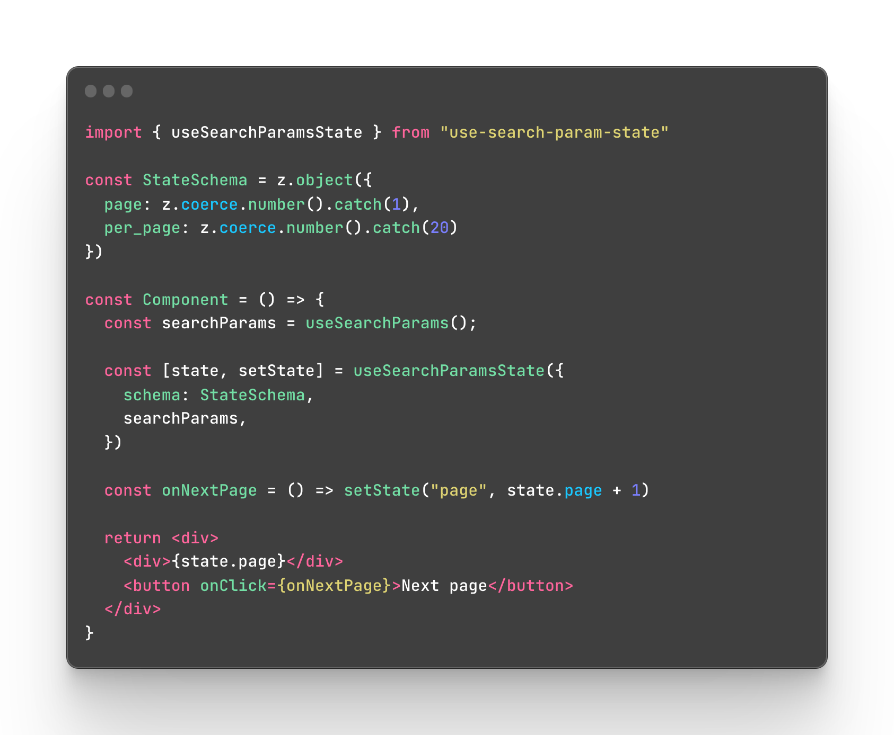

# use-search-params-state



## Features

- 🚀 `useState` hook that syncs the state with URL Search Params.
- 🤓 Keeps search params clean by automatically removing default values.
- 😳 Built for React, with Next.js integration available.
- ⚡️ Accepts Zod schema for validation and parsing.

## Getting Started

### Next.js

`pnpm add @use-search-params-state/next`

### React.js

`pnpm add @use-search-params-state/react`

## Examples

### Simple Next.js usage

Following example will render a button, which when clicked will toggle the button text between "hello" and "world". It will also update the search params to include the value, which means that after refreshing the page, the state will be preserved.

```tsx
import { useSearchParamsState } from "@use-search-params-state/next"

const Component = () => {
  const [state, setState] = useSearchParamsState();

  const handleClick = () => {
    state.greeting === 'hello'
      ? setState('greeting', 'world')
      : setState('greeting', 'hello')
  }

  return <button onClick={handleClick}>{state.greeting ?? 'hello'}</button>
}
```

### Next.js usage with default values

This example works in the same way functionally speaking. In the example above you can see that we manually fall back on the default text value for ths button, but there's a better way. You can provide `defaultValues` parameter to the `useSearchParamsState` hook as seen below. This will do 3 things:

- If no search params are provided, the `greeting` parameter will fall back the default value.
- When `greeting` search param is set to the default value, that value will be removed from the URL, since your code will automatically fallback to that value (You can disable this behavior in options, [read more here](/#todo)).
- TypeScript will understand that you have `greeting` parameter available, and will autosuggest it for you.

```tsx
import { useSearchParamsState } from "@use-search-params-state/next"

const Component = () => {
  const [state, setState] = useSearchParamsState({
    defaultValues: {
      greeting: 'hello'
    }
  });

  const handleClick = () => {
    state.greeting === 'hello'
      ? setState('greeting', 'world')
      : setState('greeting', 'hello')
  }

  return <button onClick={handleClick}>{state.greeting}</button>
}
```

## Roadmap

- [x] State comes from search params.
- [x] Set state updates search params.
- [x] Default values.
- [x] Option to remove search params if they are set to their default values.
- [x] Remove falsy values.
- [x] Preserve initial keys - keys are preserved in search params, if they were initially set.
- [x] Next.js integration.
- [ ] Array values.
- [ ] Zod validation.
- [ ] Zod default values.
- [ ] Zod optional values.
- [ ] Type-safe state from default values or when validation schema is provided.
- [ ] More validation tools (yup, etc.)
- [ ] Svelte/SvelteKit

## Credits

This project is built and maintained by [Antoni](https://github.com/bring-shrubbery)

If you need help building anything that has a frontend, check out [Quassum](https://quassum.com)

## License

[Apache 2.0 License](./LICENSE)
